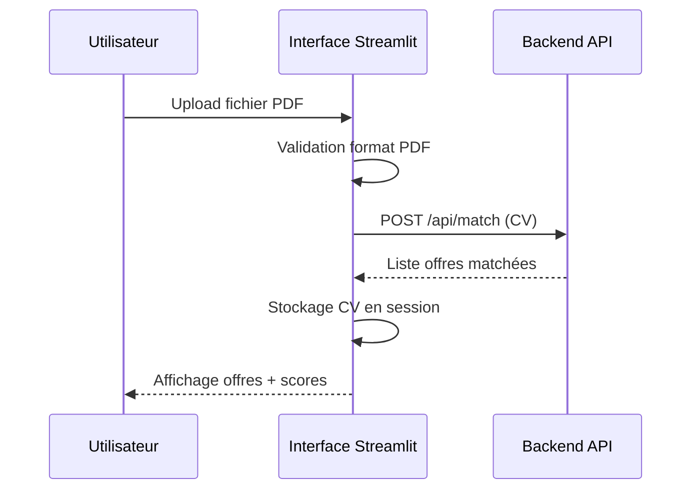
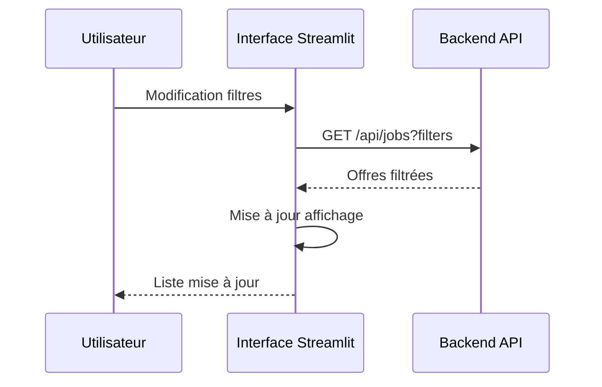
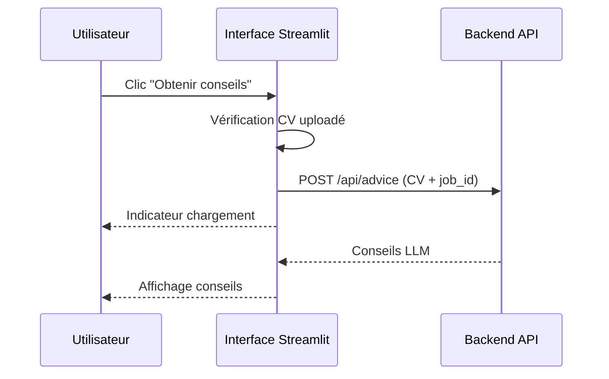

# Document de Conception

## Vue d'Ensemble

L'interface Streamlit CV-Optimizer est une application web frontend qui se connecte au backend FastAPI existant pour fournir une interface utilisateur intuitive pour le matching de CV et la recherche d'emploi. L'application utilise Streamlit pour créer une interface interactive permettant l'upload de CV, le filtrage d'offres, la consultation de détails et l'obtention de conseils personnalisés.

## Architecture

### Architecture Générale

```mermaid
graph TB
    subgraph "Frontend"
        UI[Interface Streamlit]
        Cache[Cache Session]
        State[Gestion d'État]
    end
    
    subgraph "Backend Existant"
        API[FastAPI CV-Optimizer]
        Match[/api/match]
        Jobs[/api/jobs]
        Advice[/api/advice]
        Health[/health]
    end
    
    UI --> Cache
    UI --> State
    UI --> API
    API --> Match
    API --> Jobs
    API --> Advice
    API --> Health
```

### Composants Principaux

1. **Interface Utilisateur Streamlit** : Application principale avec pages et widgets
2. **Gestionnaire d'API** : Module pour les communications avec le backend
3. **Gestionnaire d'État** : Gestion de l'état de session Streamlit
4. **Gestionnaire de Cache** : Optimisation des requêtes répétées
5. **Gestionnaire d'Erreurs** : Traitement centralisé des erreurs

## Composants et Interfaces

### 1. Application Principale (main.py)

```python
class StreamlitApp:
    def __init__(self):
        self.api_client = APIClient()
        self.state_manager = StateManager()
        
    def run(self):
        # Configuration de la page
        # Initialisation de l'état
        # Rendu de l'interface principale
```

### 2. Client API (api_client.py)

```python
class APIClient:
    def __init__(self, base_url: str = "http://localhost:8000"):
        self.base_url = base_url
        self.session = requests.Session()
    
    def health_check(self) -> bool:
        # Vérification de la connectivité
    
    def match_cv(self, cv_file: bytes) -> List[JobMatch]:
        # POST /api/match
    
    def get_jobs(self, filters: JobFilters) -> JobsResponse:
        # GET /api/jobs avec filtres
    
    def get_job_details(self, job_id: str) -> JobDetails:
        # GET /api/jobs/{job_id}
    
    def get_advice(self, cv_file: bytes, job_id: str) -> AdviceResponse:
        # POST /api/advice
```

### 3. Gestionnaire d'État (state_manager.py)

```python
class StateManager:
    def __init__(self):
        self.init_session_state()
    
    def init_session_state(self):
        # Initialisation des variables de session
    
    def set_uploaded_cv(self, cv_data: bytes, filename: str):
        # Stockage du CV en session
    
    def get_uploaded_cv(self) -> Optional[Tuple[bytes, str]]:
        # Récupération du CV de session
    
    def set_current_filters(self, filters: JobFilters):
        # Stockage des filtres actifs
    
    def clear_session(self):
        # Réinitialisation de la session
```

### 4. Composants UI (ui_components.py)

```python
class UIComponents:
    @staticmethod
    def render_cv_uploader() -> Optional[bytes]:
        # Widget d'upload de CV
    
    @staticmethod
    def render_job_filters() -> JobFilters:
        # Widgets de filtrage
    
    @staticmethod
    def render_job_list(jobs: List[JobMatch]):
        # Affichage de la liste d'offres
    
    @staticmethod
    def render_job_details(job: JobDetails):
        # Affichage des détails d'offre
    
    @staticmethod
    def render_advice_section(advice: AdviceResponse):
        # Affichage des conseils LLM
```

### 5. Gestionnaire d'Erreurs (error_handler.py)

```python
class ErrorHandler:
    @staticmethod
    def handle_api_error(error: Exception) -> str:
        # Traitement des erreurs API
    
    @staticmethod
    def handle_connection_error() -> str:
        # Traitement des erreurs de connexion
    
    @staticmethod
    def handle_validation_error(error: str) -> str:
        # Traitement des erreurs de validation
```

## Modèles de Données

### Structures de Données

```python
@dataclass
class JobFilters:
    location: Optional[str] = None
    contract_type: Optional[str] = None
    experience_level: Optional[str] = None
    page: int = 1
    page_size: int = 20

@dataclass
class JobMatch:
    job_id: str
    title: str
    company: str
    location: str
    contract_type: str
    match_score: float
    summary: str

@dataclass
class JobDetails:
    job_id: str
    title: str
    company: str
    location: str
    contract_type: str
    experience_level: str
    description: str
    requirements: List[str]
    benefits: List[str]
    salary_range: Optional[str]

@dataclass
class AdviceResponse:
    job_id: str
    advice_sections: List[AdviceSection]
    overall_score: float
    improvement_areas: List[str]

@dataclass
class AdviceSection:
    section_title: str
    content: str
    priority: str  # "high", "medium", "low"
```

### Interface de Navigation

```python
class NavigationState:
    current_page: str  # "home", "job_details", "advice"
    selected_job_id: Optional[str]
    show_filters: bool
    
class PageManager:
    def render_home_page(self):
        # Page principale avec upload et liste
    
    def render_job_details_page(self, job_id: str):
        # Page de détails d'offre
    
    def render_advice_page(self, job_id: str):
        # Page de conseils personnalisés
```

## Structure de l'Interface Utilisateur

### Layout Principal

```
┌─────────────────────────────────────────┐
│ 🎯 CV-Optimizer - Interface Streamlit   │
├─────────────────────────────────────────┤
│ 📄 Upload CV                            │
│ [Choisir un fichier PDF] [Analyser]     │
├─────────────────────────────────────────┤
│ 🔍 Filtres                              │
│ Localisation: [____] Type: [____]       │
│ Expérience: [____] [Appliquer]          │
├─────────────────────────────────────────┤
│ 📋 Offres d'Emploi (X résultats)        │
│ ┌─────────────────────────────────────┐ │
│ │ Titre Poste - Entreprise            │ │
│ │ 📍 Localisation | 📄 Type Contrat   │ │
│ │ ⭐ Score: 85% | [Voir Détails]      │ │
│ └─────────────────────────────────────┘ │
│ ┌─────────────────────────────────────┐ │
│ │ ...autres offres...                 │ │
│ └─────────────────────────────────────┘ │
└─────────────────────────────────────────┘
```

### Page de Détails d'Offre

```
┌─────────────────────────────────────────┐
│ ← Retour | 💼 Détails de l'Offre        │
├─────────────────────────────────────────┤
│ Titre du Poste                          │
│ Entreprise - Localisation               │
│ Type de Contrat | Niveau d'Expérience   │
├─────────────────────────────────────────┤
│ 📝 Description                          │
│ [Contenu de la description...]          │
├─────────────────────────────────────────┤
│ ✅ Exigences                            │
│ • Exigence 1                            │
│ • Exigence 2                            │
├─────────────────────────────────────────┤
│ 🎁 Avantages                            │
│ • Avantage 1                            │
│ • Avantage 2                            │
├─────────────────────────────────────────┤
│ [Obtenir des Conseils Personnalisés]    │
└─────────────────────────────────────────┘
```

## Flux de Données

### 1. Upload et Matching de CV



### 2. Filtrage des Offres



### 3. Conseils Personnalisés



## Gestion des Erreurs

### Stratégie de Gestion d'Erreurs

1. **Erreurs de Connectivité**
   - Vérification health check au démarrage
   - Retry automatique avec backoff exponentiel
   - Messages d'erreur clairs en français

2. **Erreurs de Validation**
   - Validation côté client avant envoi
   - Messages d'aide contextuelle
   - Guidage utilisateur pour correction

3. **Erreurs API**
   - Mapping des codes d'erreur HTTP
   - Messages d'erreur traduits
   - Actions de récupération suggérées

### Codes d'Erreur et Messages

```python
ERROR_MESSAGES = {
    "connection_error": "Impossible de se connecter au serveur. Vérifiez votre connexion.",
    "invalid_pdf": "Le fichier doit être au format PDF.",
    "file_too_large": "Le fichier est trop volumineux (max 10MB).",
    "no_cv_uploaded": "Veuillez d'abord uploader un CV.",
    "api_timeout": "La requête a pris trop de temps. Veuillez réessayer.",
    "server_error": "Erreur serveur. Veuillez réessayer plus tard."
}
```

## Configuration et Déploiement

### Variables de Configuration

```python
class Config:
    API_BASE_URL = os.getenv("API_BASE_URL", "http://localhost:8000")
    MAX_FILE_SIZE = int(os.getenv("MAX_FILE_SIZE", "10485760"))  # 10MB
    REQUEST_TIMEOUT = int(os.getenv("REQUEST_TIMEOUT", "30"))
    CACHE_TTL = int(os.getenv("CACHE_TTL", "300"))  # 5 minutes
    PAGE_SIZE = int(os.getenv("PAGE_SIZE", "20"))
```

### Structure des Fichiers

```
streamlit_interface/
├── main.py                 # Point d'entrée Streamlit
├── config.py              # Configuration
├── api_client.py          # Client API
├── state_manager.py       # Gestion d'état
├── ui_components.py       # Composants UI
├── error_handler.py       # Gestion d'erreurs
├── models.py              # Modèles de données
├── utils.py               # Utilitaires
├── requirements.txt       # Dépendances Python
└── README.md             # Documentation
```

## Optimisations Performance

### Stratégies de Cache

1. **Cache de Session Streamlit**
   - CV uploadé conservé en session
   - Filtres appliqués mémorisés
   - Résultats de recherche temporaires

2. **Cache des Requêtes API**
   - Cache TTL pour les listes d'offres
   - Invalidation intelligente du cache
   - Compression des réponses

3. **Optimisations UI**
   - Pagination des résultats
   - Chargement lazy des détails
   - Debouncing des filtres

### Métriques de Performance

- Temps de chargement initial < 3 secondes
- Temps de réponse API < 5 secondes
- Taille maximale fichier PDF : 10MB
- Cache TTL : 5 minutes pour les offres

## Propriétés de Correction

*Une propriété est une caractéristique ou un comportement qui doit être vrai dans toutes les exécutions valides d'un système - essentiellement, une déclaration formelle sur ce que le système doit faire. Les propriétés servent de pont entre les spécifications lisibles par l'homme et les garanties de correction vérifiables par machine.*

### Propriété 1: Validation de fichiers PDF
*Pour tout* fichier uploadé, la validation doit accepter uniquement les fichiers au format PDF valide et rejeter tous les autres formats
**Valide: Exigences 1.1**

### Propriété 2: Appels API corrects pour matching
*Pour tout* CV valide uploadé, l'interface doit envoyer une requête POST /api/match avec le fichier en paramètre
**Valide: Exigences 1.2**

### Propriété 3: Affichage des résultats de matching
*Pour toute* réponse valide de l'API de matching, l'interface doit afficher tous les jobs retournés avec leurs scores de correspondance
**Valide: Exigences 1.3**

### Propriété 4: Gestion d'erreurs API
*Pour toute* erreur API (connexion, timeout, erreur serveur), l'interface doit afficher un message d'erreur approprié en français
**Valide: Exigences 1.4, 3.4, 4.5, 6.1, 6.2**

### Propriété 5: Appels API avec filtres
*Pour toute* combinaison de filtres appliqués, l'interface doit envoyer une requête GET /api/jobs avec les paramètres de filtre correspondants
**Valide: Exigences 2.2**

### Propriété 6: Mise à jour réactive des filtres
*Pour tout* changement de filtres, l'interface doit automatiquement déclencher une nouvelle requête et mettre à jour l'affichage
**Valide: Exigences 2.3**

### Propriété 7: Affichage des résultats filtrés
*Pour toute* réponse de l'API jobs avec filtres, l'interface doit afficher uniquement les offres correspondant aux critères sélectionnés
**Valide: Exigences 2.4**

### Propriété 8: Navigation vers les détails
*Pour tout* job sélectionné dans la liste, l'interface doit envoyer une requête GET /api/jobs/{job_id} avec l'ID correct
**Valide: Exigences 3.1**

### Propriété 9: Affichage structuré des détails
*Pour toute* réponse valide de détails d'offre, l'interface doit afficher tous les champs requis (titre, entreprise, description, exigences, avantages)
**Valide: Exigences 3.2**

### Propriété 10: Affichage conditionnel du bouton conseils
*Pour tout* état de l'application, le bouton "Obtenir des conseils" doit être visible si et seulement si un CV a été uploadé et qu'une offre est consultée
**Valide: Exigences 4.1**

### Propriété 11: Appels API pour conseils
*Pour toute* demande de conseils, l'interface doit envoyer une requête POST /api/advice avec le CV et l'ID de l'offre
**Valide: Exigences 4.2**

### Propriété 12: Affichage des conseils
*Pour toute* réponse valide de conseils, l'interface doit afficher toutes les sections de conseils de manière structurée
**Valide: Exigences 4.3**

### Propriété 13: Indicateurs de chargement
*Pour toute* opération longue (API calls), l'interface doit afficher un indicateur de chargement pendant l'exécution
**Valide: Exigences 4.4, 5.2, 7.2**

### Propriété 14: Messages en français
*Pour tout* message affiché à l'utilisateur, le texte doit être en français
**Valide: Exigences 5.3**

### Propriété 15: Persistance d'état de session
*Pour toute* session utilisateur, l'état (CV uploadé, filtres appliqués) doit être maintenu à travers les interactions
**Valide: Exigences 5.4**

### Propriété 16: Mécanisme de retry
*Pour toute* requête API échouée temporairement, l'interface doit automatiquement retenter la requête selon la stratégie de retry configurée
**Valide: Exigences 6.3**

### Propriété 17: Vérification de santé au démarrage
*Pour tout* démarrage de l'application, l'interface doit vérifier la connectivité au backend via GET /health
**Valide: Exigences 6.4**

### Propriété 18: Aide contextuelle pour erreurs de validation
*Pour toute* erreur de validation, l'interface doit afficher un message d'aide guidant l'utilisateur vers la correction
**Valide: Exigences 6.5**

### Propriété 19: Cache des résultats de recherche
*Pour toute* requête identique répétée dans la période de cache, l'interface doit utiliser les résultats en cache plutôt que de faire un nouvel appel API
**Valide: Exigences 7.3**

### Propriété 20: Limitation de taille de fichier
*Pour tout* fichier uploadé, l'interface doit rejeter les fichiers dépassant la taille maximale configurée
**Valide: Exigences 7.4**

## Gestion d'Erreurs

### Stratégie de Gestion d'Erreurs

L'interface implémente une approche en couches pour la gestion d'erreurs :

1. **Validation côté client** : Vérification des formats de fichiers, tailles, champs requis
2. **Gestion des erreurs réseau** : Retry automatique, timeouts, messages de connectivité
3. **Traitement des erreurs API** : Mapping des codes HTTP vers des messages utilisateur
4. **Récupération gracieuse** : Actions alternatives proposées à l'utilisateur

### Types d'Erreurs et Réponses

- **Erreurs de validation** : Messages d'aide contextuelle, guidage vers correction
- **Erreurs de connectivité** : Vérification de connexion, retry automatique
- **Erreurs serveur** : Messages d'attente, suggestion de réessayer plus tard
- **Timeouts** : Indication de lenteur réseau, option de retry manuel

## Stratégie de Test

### Approche de Test Dual

L'application utilise une approche combinant tests unitaires et tests basés sur les propriétés :

**Tests Unitaires** :
- Exemples spécifiques de validation de fichiers
- Cas limites (fichiers vides, très grands)
- Scénarios d'erreur spécifiques
- Éléments UI présents (boutons, contrôles)

**Tests Basés sur les Propriétés** :
- Validation universelle des formats de fichiers
- Comportement correct des appels API pour toutes les entrées
- Affichage cohérent des données pour toutes les réponses API
- Gestion d'erreurs pour tous les types d'échecs

### Configuration des Tests de Propriétés

- **Bibliothèque** : Hypothesis pour Python (tests basés sur les propriétés)
- **Itérations minimales** : 100 par test de propriété
- **Format de tag** : **Feature: streamlit-interface, Property {number}: {property_text}**
- **Couverture** : Chaque propriété de correction doit être implémentée par UN SEUL test de propriété

### Exemples de Tests

```python
# Test de propriété pour validation PDF
@given(file_data=st.binary(), filename=st.text())
def test_pdf_validation_property(file_data, filename):
    """Feature: streamlit-interface, Property 1: PDF validation"""
    is_pdf = filename.lower().endswith('.pdf') and is_valid_pdf(file_data)
    result = validate_uploaded_file(file_data, filename)
    assert result.is_valid == is_pdf

# Test unitaire pour cas spécifique
def test_empty_file_rejection():
    """Test rejection of empty files"""
    result = validate_uploaded_file(b"", "empty.pdf")
    assert not result.is_valid
    assert "fichier vide" in result.error_message.lower()
```

### Intégration Continue

- Tests automatisés sur chaque commit
- Validation des propriétés avant déploiement
- Métriques de couverture de code
- Tests de régression pour les corrections de bugs